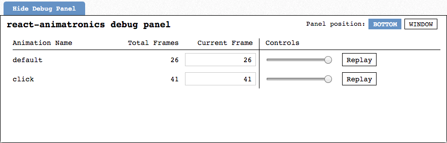

# Walkthrough

A step-by-step guide that goes through every aspect of react-animatronics.


## Table of Contents

- [01. Basics](#basics)
- [02. Higher-Order Components](#hocs)
- [03. Multi-Phase Animations](#multi_phase)
- [04. Animating Attributes Simultaneously](#simultaneous_attrs)
- [05. Animating Components Simultaneously](#simultaneous_components)
- [06. Named Animations](#named_animations)
- [07. Accessing DOM Nodes](#dom_nodes)
- [08. Debug Panel](#debug)
- [09. Spring Animations](#springs)
- [10. Custom Easing](#custom_easing)
- [11. Delays](#delays)
- [12. Animatable Values](#animatable)


## <a name='basics'></a> 01. Basics

React-animatronics provides two components: `<Animatronics>` and `<Control>`.
Both components take a FaCC, a single child that must be a function.

> React Tip: "**F**unctions **a**s **C**hild **C**omponents (FaCC)" is a common
> React pattern for component encapsulation/reusability. It goes by a few other
> aliases, most notably "render props". If this is the first time you're hearing
> about this, here are some articles:
>
> - ["Function as Child Components" by Merrick Christensen][facc]
> - ["Use a Render Prop!" by Michael Jackson][render_prop]

Here's a non-working code example just showing how you'd use the components:

```js
import { Animatronics, Control } from 'react-animatronics'

const animations = [/* intentionally blank for now */];

const App = () => (
  <Animatronics animations={ animations }>{
    ({ playAnimation }) => (
      <Control name='square'>{
        ({ animatronicStyles }) => (
          <div
            style={{
              backgroundColor: 'blue',
              height: '100px',
              width: '100px',
              cursor: 'pointer',
              position: 'absolute',
              ...animatronicStyles
            }}
            onClick={() => playAnimation()}
          />
        )
      }</Control>
    )
  }</Animatronics>
);
```

Let's start with the `<Animatronics>` component.

The `<Animatronics>` component is the "animation runner". It provides functions
and context to its children that allow you to run animations involving any
**controlled component** in its decendants.

The `<Animatronics>` component requires an `animations` prop that we'll
describe in the last part of this section.  For now, let's focus on the
`playAnimation` prop it passes into its child.  When you call `playAnimation`,
react-animatronics will execute the `animations` you've declared.

If you need to execute logic after `playAnimation` has completed, you can either
pass a callback or call `.then` on the returned promise:

```js
playAnimation(() => {
  /* execute logic */
});

playAnimation().then(() => {
  /* execute logic */
});
```

In addition to `playAnimation`, the child also gets `cancelAnimation` and `reset`:

```js
<Animatronics animations={ animations }>{
  ({ playAnimation, cancelAnimation, reset }) => ()
}</Animatronics>
```

The `cancelAnimation` function will stop currently running animations.

The `reset` function will stop running animations _and_ remove any styles that
react-animatronics has applied to your components.

Now let's look into the `<Control>` component.

The `<Control>` component works in tandem with `<Animatronics>`. In fact, it must
have an `<Animatronics>` component as its ancestor.

The `<Control>` component makes its child a controlled component by registering
the child with its `<Animatronics>` ancestor.

`<Control>` takes a single `name` prop that must be a string which uniquely
identifies its child component. The `name` prop is important when declaring
your `animations` (more on this later).

`<Control>` will pass a single `animatronicStyles` prop to it child. The
`animatronicStyles` is an object that contains the interpolated values for your
animation.

An important, performance-related note. When an animation is running, the
`<Control>` component will update its child with new `animatronicStyles` on
every animation frame (60 frames per second is approximately one frame every 17
milliseconds). If you're rendering expensive components within a `<Control>`,
you'll likely want to define `shouldComponentUpdate()` or reorganize your
components such that the expensive parts are outside of `<Control>`.

Finally, let's look into how to define the `animations` you pass into `<Animatronics>`.

In its most basic form, the `animations` prop can be an array of objects:

```js
const animations = [
  {
    square: {
      duration: 500,
      from: { left: '0px' },
      to: { left: '200px' }
    }
  }
]
```

Each element in the array describes a single **animation phase**. In the
snippet above, we've declared an animation with a single phase. We'll go into
declaring more than one phase in the [Multi-Phase Animations](#multi_phase)
section, but we're going to keep things simple in this section.

That single phase describes how the controlled component named `"square"`
should be animated.

When we call `playAnimation()`, that component will receive an updated
`animatronicStyles` prop on every animation frame over the course of 500
milliseconds.

That's it for the basics! Next up, a short detour into an alternative, HoC API.


## <a name='hocs'></a> 02. Higher-Order Components

For those who would rather use higher-order components instead of FaCCs,
react-animatronics provides two HoCs: `withAnimatronics` and `withControl`.

> React Tip: "**H**igher-**O**rder **C**omponents (HoC)" is another common
> React pattern for component encapulation/reusability. More info:
>
> - ["Higher-Order Components" - official React docs][higher_order]

The `withAnimatronics` and `withControl` functions work in very much the same
way as their component counterparts:

```js
import { withAnimatronics, withControl } from 'react-animatronics'

const animations = [/* intentionally blank for simplicity */];

const Square = ({ playAnimation, animatronicStyles }) => (
  <div
    style={{
      backgroundColor: 'blue',
      height: '100px',
      width: '100px',
      cursor: 'pointer',
      position: 'absolute',
      ...animatronicStyles
    }}
    onClick={() => playAnimation()}
  />
);

const Controlled = withControl('square')(Square);

const App = withAnimtronics(animations)(Controlled);
```

In fact, both HoCs are implemented in terms of their component counterparts.

The `withAnimatronics` function expects a single `animations` argument that
will internally be passed as a prop to `<Animatronics>`. It will pass the
`playAnimation`, `cancelAnimation,` and `reset` props into its wrapped
component.

The `withControl` function expects a single `name` argument that will
internally be passed as a prop to `<Control>`. It will pass the
`animatronicStyles` prop into its wrapped component.

I won't go into the pros and cons of HoCs vs FaCCs. I think there's a time and
place for both, which is why they're both in react-animatronics. In the rest
of this walkthrough, I'll be referring to `<Animatronics>` and `<Control>`
but they'll always be interchangeable with `withAnimatronics` and `withControl`,
respectively.

That's it! Next up, declaring a sequence of animation phases.


## <a name='multi_phase'></a> 03. Multi-Phase Animations

The title "Multi-Phase Animations" sounds more fancy than the concept it
describes. Here's what it is:

```
const animations = [
  {
    square: {
      duration: 500,
      from: { left: '0px' },
      to: { left: '200px' }
    }
  },
  {
    square: {
      duration: 500,
      from: { top: '0px' },
      to: { top: '200px' }
    }
  }
];
```

Instead of declaring a single phase, we've now declared two. When you call
`playAnimation`, the `"square"` controlled component will first animate its
`left`, and then its `top`. The phases occur in sequence, one after the other.

That's it! Next up, animating multiple attributes simultaneously.


## <a name='simultaneous_attrs'></a> 04. Animating Attributes Simultaneously

In the previous `animation` examples, we've only declared a single
attribute in `from` and `to`, but you can declare multiple attributes:

```
const animations = [
  {
    square: {
      duration: 500,
      from: {
        left: '0px',
        top: '0px'
      },
      to: {
        left: '200px',
        top: '200px'
      }
    }
  }
];
```

This describes an animation that will animate the `left` and `top` attributes
at the same time such that the `"square"` component will move diagonally down to
the right.

But that's not all! There's another way to animate attributes simultaneously.
Sometimes you'll want to animate different attributes in different ways while
still animating them simultaneously. To so this, you can declare `animations`
with a slightly different format:

```js
const animations = [
  {
    square: [
      {
        duration: 500,
        from: { left: '0px' },
        to: { left: '200px' },
      },
      {
        duration: 300,
        from: { top: '0px' },
        to: { top: '200px' },
      }
    ]
  }
];
```

Previously, we declared the value for `square` as an object, but now we've declared
it as an array. Each object in the array describes an animation that will occur in
parallel with the other animations in the array. Now, instead of moving in a straight
line, the `"square"` component will curve down to the right.

That's it! Next up, animating multiple components simultaneously.


## <a name='simultaneous_components'></a> 05. Animating Components Simultaneously

This is where things get really interesting. Up until now, we've only been
dealing with a single `"square"` component, but react-animatronics separates
itself from other libraries because it allows you to describe animations
involving multiple components anywhere in your component hierarchy:

```js
import { Animatronics, Control } from 'react-animatronics'

const Square = ({ animatronicStyles }) => (
  <div
    style={{
      backgroundColor: 'blue',
      height: '100px',
      width: '100px',
      cursor: 'pointer',
      position: 'absolute',
      ...animatronicStyles
    }}
  />
);

const SquareOne = () => (
  <Control name='squareOne'>{
    ({ animatronicStyles }) => (
      <Square animatronicStyles={ animatronicStyles } />
    )
  }</Control>
);

const SquareTwo = () => (
  <Control name='squareTwo'>{
    ({ animatronicStyles }) => (
      <Square animatronicStyles={ animatronicStyles } />
    )
  }</Control>
);

const animations = [
  {
    squareOne: {
      duration: 500,
      from: { left: '0px' },
      to: { left: '200px' }
    },
    squareTwo: {
      duration: 500,
      from: { top: '0px' },
      to: { top: '200px' }
    },
  }
];

const App = () => (
  <Animatronics animations={ animations }>{
    ({ playAnimation }) => (
      <div onClick={() => playAnimation()}>
        <SquareOne />
        <SquareTwo />
      </div>
    )
  }</Animatronics>
);
```

Take note of the `animations` prop. It has a single phase, but within that phase
it describes animations for the two components `"squareOne"` and `"squareTwo"`.
When you execute the animation, you'll see one square move right and the other
move down at the same time.

Now is a good time to note that most of what you learn about `animations` can
be combined. For example, you can combine simultaneous attribute animations
with simultaneous component animations:

```js
const animations = [
  {
    squareOne: {
      duration: 500,
      from: {
        left: '0px',
        height: '100px',
      },
      to: {
        left: '200px',
        height: '200px'
      }
    },
    squareTwo: {
      duration: 500,
      from: {
        top: '0px',
        width: '100px'
      },
      to: {
        top: '200px',
        width: '200px'
      }
    },
  }
];
```

That's it! Next up, declaring different, named animations within the same
`animations` prop.


## <a name='named_animations'></a> 06. Named Animations

You can declare multiple animations for a single `<Animatronics>` component
by providing an `animations` object instead of an array:

```js
const animations = {
  moveRight: [
    {
      square: {
        duration: 500,
        from: { left: '0px' },
        to: { left: '200px' }
      }
    }
  ],
  moveDown: [
    {
      square: {
        duration: 500,
        from: { top: '0px' },
        to: { top: '200px' }
      }
    }
  ]
};
```

The object keys are the **animation names** and the values are the same
animation arrays we've gone over in previous examples.

You can select which animation you want to execute by passing the string
name into `playAnimation`:

```js
playAnimation('moveRight');
playAnimation('moveDown');
```

Note, if you've declared named animations, you **must** pass a name into
`playAnimation`. Otherwise, it will default to playing an animation
named `"default"`, which won't exist unless you've defined that too.

You can still pass in a callback or call `.then` on the returned promise:

```js
playAnimation('moveRight', () => {
  /* execute logic */
});

playAnimation('moveRight').then(() => {
  /* execute logic */
});
```

To cancel your animations, pass the name into `cancelAnimation`:

```js
cancelAnimation('moveRight');
cancelAnimation('moveDown');
```

You can call `cancelAnimation` with no arguments and it will cancel
all currently running animations.

However, resetting your animations is different. The `reset` function never
accepts any arguments and will always reset the styles for every controlled
component under `<Animatronics>`. There are two reasons for this. One, it keeps
the implementation simple, and two, I haven't run into a use case for resetting
named animations individually.

That's it! Next up, accessing DOM nodes in your animations.


## <a name='dom_nodes'></a> 07. Accessing DOM Nodes

You can access the DOM nodes of your controlled components inside your
`animations`:

```js
import { Animatronics, Control } from 'react-animatronics'

class Square extends React.Component {
  render() {
    const { animatronicsStyles, style } = this.props;
    return (
      <div
        style={{
          backgroundColor: 'blue',
          height: '100px',
          width: '100px',
          cursor: 'pointer',
          position: 'absolute',
          ...style,
          ...animatronicStyles
        }}
      />
    );
  }
}

const SquareOne = () => (
  <Control name='squareOne'>{
    ({ animatronicStyles }) => (
      <Square
        animatronicStyles={ animatronicStyles }
        style={{
          top: '0px',
          left: '0px'
        }}
      />
    )
  }</Control>
);

const SquareTwo = () => (
  <Control name='squareTwo'>{
    ({ animatronicStyles }) => (
      <Square
        animatronicStyles={ animatronicStyles }
        style={{
          top: '0px',
          left: '200px'
        }}
      />
    )
  }</Control>
);

const SquareThree = () => (
  <Control name='squareThree'>{
    ({ animatronicStyles }) => (
      <Square
        animatronicStyles={ animatronicStyles }
        style={{
          top: '200px',
          left: '0px'
        }}
      />
    )
  }</Control>
);

const animations = ({ squareOne, squareTwo, squareThree }) => {
  const { left: leftOne, top: topOne } = squareOne.getBoundingClientRect();
  const { left: leftTwo, top: topTwo } = squareTwo.getBoundingClientRect();
  const { left: leftThree, top: topThree } = squareThree.getBoundingClientRect();
  return [
    {
      squareOne: {
        duration: 500,
        from: {
          left: `${ leftOne }px`,
          top: `${ topOne }px`
        },
        to: {
          left: `${ leftTwo }px`,
          top: `${ topTwo }px`
        }
      },
      squareTwo: {
        duration: 500,
        from: {
          left: `${ leftTwo }px`,
          top: `${ topTwo }px`
        },
        to: {
          left: `${ leftThree }px`,
          top: `${ topThree }px`
        }
      },
      squareThree: {
        duration: 500,
        from: {
          left: `${ leftThree }px`,
          top: `${ topThree }px`
        },
        to: {
          left: `${ leftOne }px`,
          top: `${ topOne }px`
        }
      },
    }
  ];
};

const App = () => (
  <Animatronics animations={ animations }>{
    ({ playAnimation }) => (
      <div onClick={() => playAnimation()}>
        <SquareOne />
        <SquareTwo />
        <SquareThree />
      </div>
    )
  }</Animatronics>
);
```

Note, `animations` is now a function that returns the array we're already
familiar with. When `animations` is a function, react-animatronics will call it
with an object. That object has keys that are the names of your controlled
components and values that are their DOM nodes. React-animatronics is able to
provide the DOM nodes because `<Control>` attaches a ref to its child (make
sure the child function returns a class component, and not a stateless
component because React does not allow refs on stateless components).

In this example, we're animating three squares in a clockwise rotation. Each
square is moving to the position of another square, and we're getting the
actual positions of each square by calling `getBoundingClientRect` on their DOM
nodes.

That's it! Next up, debugging your animations.

## <a name='debug'></a> 08. Debug Panel

React-animatronics provides a helpful `<DebugPanel>` component:

```js
import { DebugPanel } from 'react-animatronics'

const App = () => (
  <DebugPanel />
);
```

Simply mount the component anywhere in your app and you'll see this:



The `<DebugPanel>` records all animations that go through react-animatronics.
You can replay the animation by clicking the "Replay" button. You can also
manually play back the animation by adjusting the slider or the "Current Frame"
input.

To hide the panel, you can click the blue "Hide Debug Panel" tab in the upper
left.

To render the panel in a separate window, click on the "Window" button in the
upper right.

It's up to you to determine when to render the `<DebugPanel>`. You'll probably
want to put it behind a `NODE_ENV === 'production'` check or just leave it out
entirely and only use it when needed.

That's it! We're going to be shifting gears now. The follwing sections will
be quick overviews of the various options you can declare in your animations.
Next up, springs.


## <a name='springs'></a> 09. Spring Animations

Inspired by the awesome [react-motion][motion] library, react-animatronics
allows you to describe your animations with springs:

```js
const animations = [
  {
    square: {
      stiffness: 200,
      damping: 20,
      from: { left: '0px' },
      to: { left: '200px' }
    }
  }
];
```

Instead of a millisecond `duration`, you can provide a `stiffness` and `damping`.
If you haven't used spring animations, I highly recommend looking through the
react-motion library. It'll give you a good feel for how they work.

I adapted the spring implementation from react-motion into react-animatronics,
so the `stiffness` and `damping` values should function the same way.

That's it! Next up, a return to timed animations.


## <a name='custom_easing'></a> 10. Custom Easing

Whenever you provide your `animations` with a `duration`, react-animatronics
will provide a default easing function of `cubic-bezier(0.4, 0.0, 0.2, 1)`,
which is the ["Standard curve"][material] from Material Design. Here's how
you would provide your own easing function:

```js
import { BezierEasing } from 'react-animatronics'

const animations = [
  {
    square: {
      duration: 500,
      easing: BezierEasing(0.37, 0.11, 0.64, 1),
      from: { left: '0px' },
      to: { left: '200px' }
    }
  }
];
```

The `BezierEasing` function comes straight from the [bezier-easing][easing] library.

That's it! Next up, delaying your animations.


## <a name='delays'></a> 11. Delays

You can provide an optional, millisecond `delay` to your `animations`:

```js
const animations = [
  {
    squareOne: {
      duration: 500,
      delay: 0,
      from: { left: '0px' },
      to: { left: '200px' }
    },
    squareTwo: {
      duration: 500,
      delay: 200,
      from: { left: '0px' },
      to: { left: '200px' }
    },
    squareThree: {
      duration: 500,
      delay: 400,
      from: { left: '0px' },
      to: { left: '200px' }
    }
  }
];
```

Doing so basically wraps the animation execution in a `setTimeout` with the
given `delay`. The primary use case for this is to create staggered animations.

That's it! We're almost done. The last section covers the range of values
react-animatronics can interpolate.


## <a name='animatable'></a> 12. Animatable Values

Up until now, we've been using strings in the `from` and `to` attributes of our
animations, so we already know react-animatronics can correctly interpolate
strings such `"0px"` to `"100px"`. In order to do this, it does a simple
regex match to extract the number from the units. However, it can work with
more than just unit strings:

```
const animations = [
  {
    square: {
      duration: 500,
      from: {
        left: '0px',
        right: '0%',
        opacity: 0,
        backgroundColor: 'blue',
        transform: 'scale(0)',
        boxShadow: '0px 0px 0px red, 0px 0px 0px green'
      },
      to: {
        left: '200px',
        right: '20%',
        opacity: 1,
        backgroundColor: 'red',
        transform: 'scale(1)',
        boxShadow: '2px 2px 2px blue, 3px 3px 3px green'
      }
    }
  }
];
```

It works with:

- numbers
- unit strings e.g. `"100px"`, `"50rem"`
- percentage strings
- colors
- transforms
- box shadows (`from` and `to` must have the same number of shadows)


But that's not all! You can also animate between any valid [CSS length][length]:

```js
const animations = [
  {
    square: {
      duration: 500,
      from: {
        left: 'calc(100% - 5em)',
      },
      to: {
        left: '0px',
      }
    }
  }
];
```

However, be cautious when doing this. React-animatronics uses
[`getComputedStyle`][getComputedStyle] to do this, so you may run into
unexpected behavior accross different browsers. It also needs to temporarily
manipulate the `style` on the actual DOM nodes, so your controlled components
need to be class components.

One more thing! You can simultaneously animate different transforms:

```js
const animations = [
  {
    square: [
      {
        duration: 500,
        from: {
          transform: 'scale(0)',
        },
        to: {
          transform: 'scale(1)',
        }
      },
      {
        duration: 300,
        from: {
          transform: 'translateX(0px)',
        },
        to: {
          transform: 'translateX(100px)',
        }
      },
      {
        duration: 400,
        from: {
          transform: 'translateY(0px)',
        },
        to: {
          transform: 'translateY(100px)',
        }
      },
    ]
  }
];
```

React-animatronics will merge the transformations so they all get applied as
expected. This gives you a ton of flexibility with transforms, which is a good
thing since [they're less expensive to animate][anim_perf].

That's the end of the walkthrough. If any parts were confusing or unclear, please
let me know by [filing an issue][issue] or [submitting a pull request][pr].

Enjoy using react-animatronics and let me know how I can make it better. Thanks!


[pr]:https://github.com/andrewkshim/react-animatronics/compare
[issue]:https://github.com/andrewkshim/react-animatronics/issues/new
[getComputedStyle]:https://developer.mozilla.org/en-US/docs/Web/API/Window/getComputedStyle
[length]:https://developer.mozilla.org/en-US/docs/Web/CSS/length
[easing]:https://github.com/gre/bezier-easing
[motion]:https://github.com/chenglou/react-motion
[facc]:https://medium.com/merrickchristensen/function-as-child-components-5f3920a9ace9
[render_prop]:https://cdb.reacttraining.com/use-a-render-prop-50de598f11ce
[higher_order]:https://reactjs.org/docs/higher-order-components.html
[material]:https://material.io/guidelines/motion/duration-easing.html#duration-easing-natural-easing-curves
[anim_perf]:https://www.html5rocks.com/en/tutorials/speed/high-performance-animations/

